# Process Near Real Time GCP

## About 

O projeto consiste em simular um processamento perto do tempo real na Google Cloud Platform.
Usando mensageria no Google Cloud Platform.

## Resources

- Scheduler
- Pub/Sub   (Mensageria)
- Cloud Functions
- BigQuery

# Criar um tópico no Pub/Sub

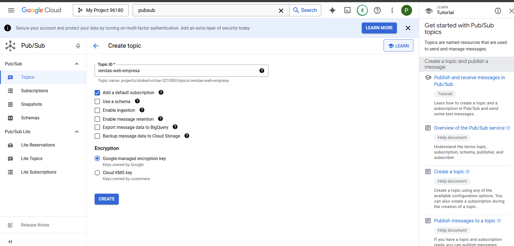

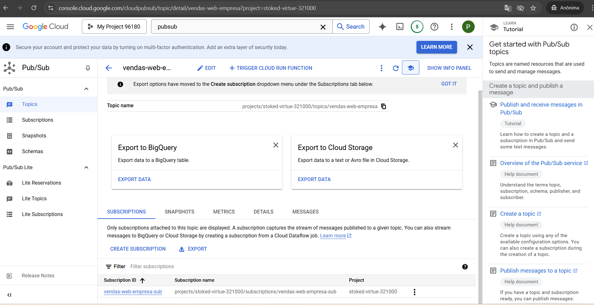

# Criar job (Scheduler)

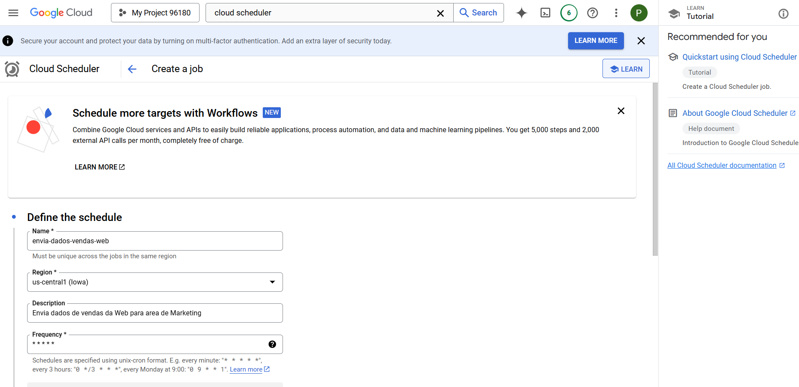

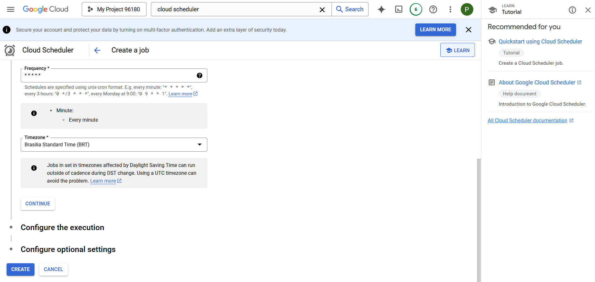

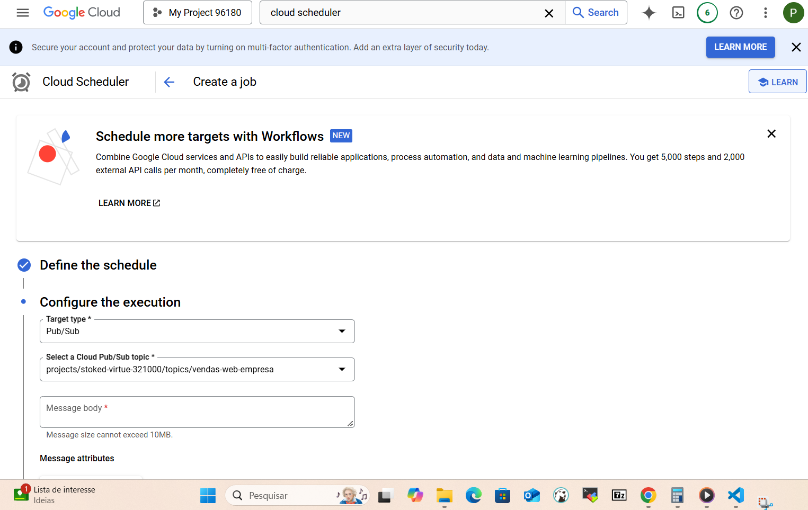

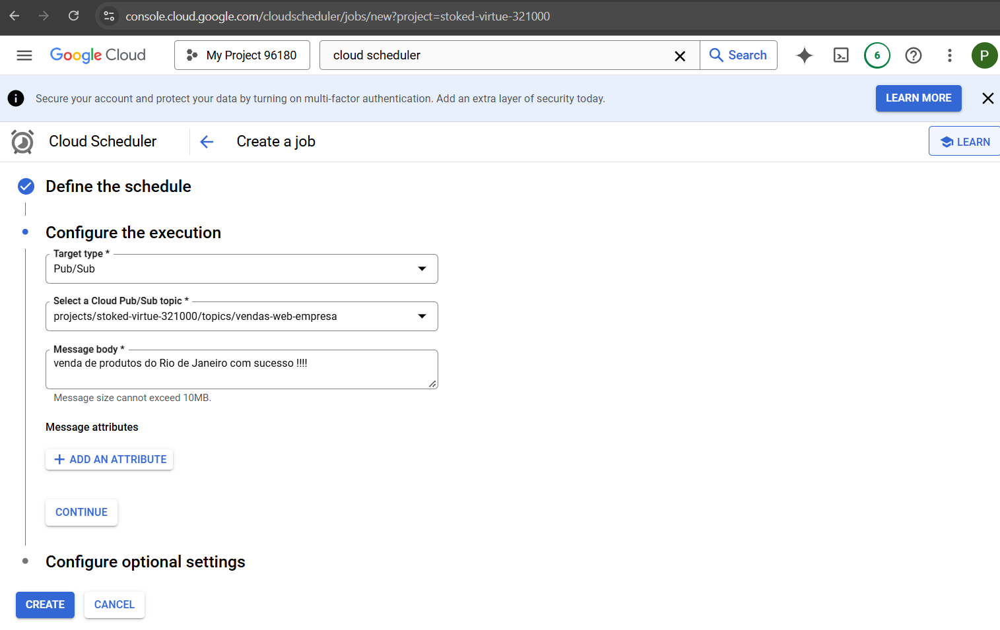

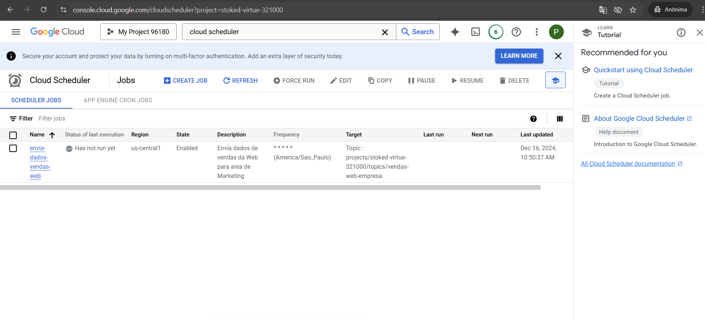

# Criar Cloud Function

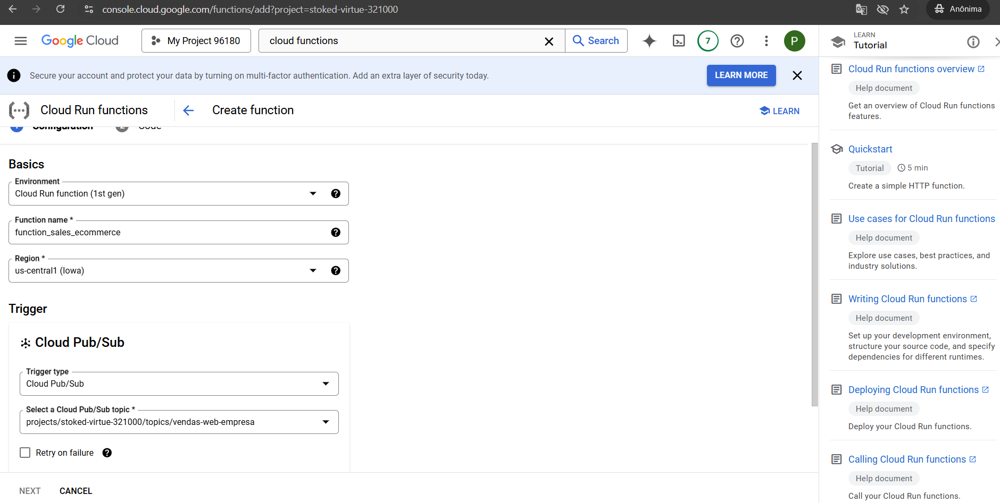

incluir codigo 

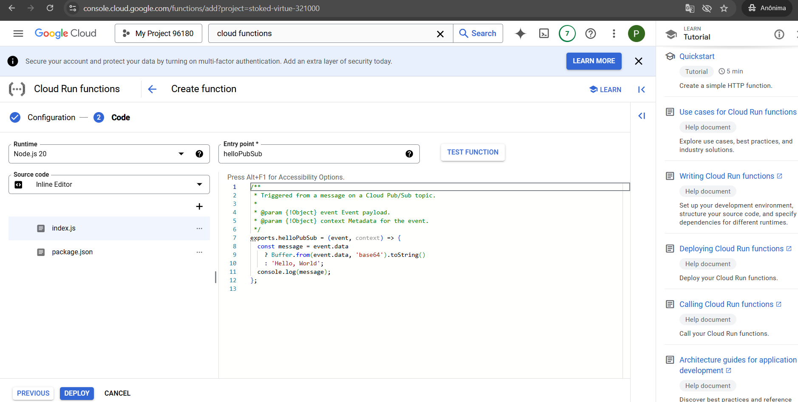

log do CLoud Function

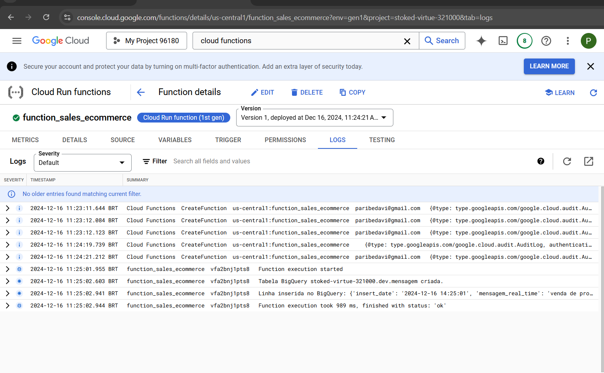

# BigQuery

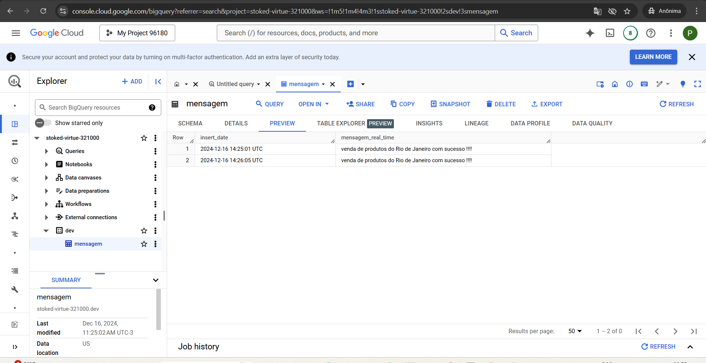

